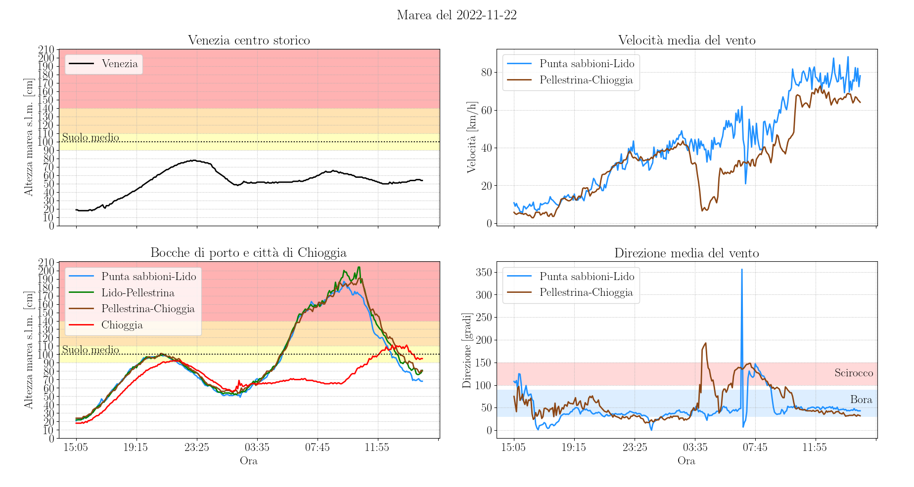

Python script per visualizzare in tempo reale l'evoluzione della marea e il fenomeno dell'acqua alta nella laguna di Venezia

# Il fenomeno dell'acqua alta
 L'altezza della marea nei centri storici di Venezia e Chioggia è determinata principalmente da due fattori: la marea astronomica e il vento. La marea astronomica determina il livello medio dell'acqua, alternando massimi e minimi ogni 6 ore circa. Il vento forte, quando presente, spinge una quantità maggiore di acqua dentro la laguna di Venezia e fa innalzare la marea. La direzione del vento determina il lato della laguna dove la marea si alza di più: lo scirocco spinge l'acqua verso Venezia, la bora verso Chioggia. 
 
## L'acqua granda del 12 novembre 2019
 Il [12 novembre 2019](http://www.ismar.cnr.it/file/news-e-eventi/Acqua_Granda_2019_v03.pdf) la marea in centro storico a Venezia ha toccato i 187 cm sul livello del mare (rilevatore di Punta Salute). La marea è stata così alta perché i venti di 100 km/h e le raffiche di 110 km/h (rilevate dalla piattaforma Acqua Alta in Adriatico) provenienti dai quadranti meridionali si sono combinati ad un accentuato minimo barico locale in corrispondenza del picco della marea astronomica. 
 
 L' evento del 12 novembre è stato eccezionale ma si è inserito in una settimana di acque alte eccezionali. Ricordando che [il piano calpestabile di Venezia si trova indicativamente a 100 cm sul medio mare](http://smu.insula.it/index.php@option=com_content&view=article&id=114&Itemid=81&lang=it.html), in 6 giorni vi sono stati 8 picchi di marea superiori ai 100 cm e 4 di essi hanno superato anche i 140 cm (eventi eccezionali).
 
  
 
## Il MOSE
Per evitare eventi eccezionali e settimane come quella del 12 novembre 2019, il [3 ottobre 2020](https://www.mosevenezia.eu/prima-prova-del-mose-contro-lacqua-alta/ ) è entrato in funzione il sistema di paratie mobili MOSE. Da allora (e sebbene ancora incompleto), il MOSE è stato azionato più volte per evitare che maree superiori ai 110 cm potessero verificarsi a Venezia. Le paratie del MOSE impediscono all'acqua del mare di entrare nella laguna di Venezia: il surplus di acqua accumulata per effetto del vento rimane confinato nell'Adriatico e la marea in laguna viene mantenuta all'incirca costante. 

### MOSE attivo
Il 15 ottobre 2020 il MOSE è entrato in funzione per la seconda volta ed ha evitato un'altra potenziale marea eccezionale. I venti di 60 km/h provenienti dai quadranti settentrionali hanno causato una marea di 130-140 cm nelle bocche di porto ma, nel mentre, la marea in laguna è rimasta stabile attorno ai 70 cm. La differenza di circa 20 cm tra Venezia e Chioggia è dovuta allo spostamento d'acqua comunque presente all'interno della laguna stessa in presenza di forte vento.

  
 
 
### MOSE non attivo
L'8 dicembre 2020 il MOSE non è stato attivato e la marea è stata eccezionale. Il forte vento ha impedito alla marea di defluire fuori dalla laguna e ha causato un minimo mareale di fatto coincidente con il picco precedente. Pertanto, il picco successivo ha avuto una base di partenza eccezionalmente alta e la continua azione del vento ha permesso di accumulare altra acqua in laguna. Senza le paratie del MOSE, a Venezia e Chioggia la marea avrebbe raggiunto il livello osservato nelle bocche di porto. In entrambe le città, la marea ha seguito l'andamento delle bocche di porto, pur manifestando un ritardo di un'ora a causa della distanza che separa i due centri storici dagli sbocchi sull'Adriatico.

  

### Un disastro evitato grazie al MOSE
Il 22 novembre 2022 l'attivazione del MOSE ha salvato la laguna di Venezia da un'acqua alta eccezionale che avrebbe molto probabilmente raggiunto almeno i 180 cm, a causa di condizioni meteorologiche molto simili a quelle responsabili dell'acqua granda del 12 novembre 2019. Il picco della marea astronomica di 75 cm è coinciso con l'arrivo di una perturbazione avente forti venti di scirocco lungo l'adriatico che si trasformavano in bora di 40-60 km/h in prossimità della laguna di Venezia. La situazione è ben rappresentata dalla mappa dei venti delle 7:00 del 22 novembre (fonte: [meteoblue](https://www.meteoblue.com/it/tempo/mappe/venezia_italia_3164603#coords=5.57/41.617/18.551&map=wind~hourly~auto~10%20m%20above%20gnd~none)). 

  

La sola azione del vento ha accumulato efficientemente per ore l'acqua lungo l'adriatico, spingendola in un secondo momento verso la laguna di Venezia e innalzando il livello mareale di più di 1 m rispetto al valore astronomico. Il picco mareale di 200 cm, toccato nella bocca di porto tra Lido e Pellestrina, si sarebbe normalmente verificato con una discrepanza di circa 15/20 cm con un'ora di ritardo anche Venezia e Chioggia. Tuttavia, l'attivazione preventiva del MOSE ha impedito che la marea si alzasse anche dentro la laguna ed ha evitato un [allagamento del centro storico di Venezia superiore all'85%](https://www.comune.venezia.it/it/content/le-percentuali-allagamento). Alle 17:30 del 21 novembre il MOSE è stato attivato nella sola bocca di porto tra Lido e Punta sabbioni. Le paratie rimanenti sono state alzate alle 2:15 del 22 novembre e hanno mantenuto in laguna una marea costante di circa 60 cm, con un accumulo di acqua maggiore verso Chioggia a causa della bora.

  

# Lo script Python
## Le stazioni meteorologiche
Il Python script **acqua_alta.py** scarica e visualizza in tempo reale i dati raccolti nelle 24 ore precedenti da alcune delle [stazioni meteorologiche usate dal Centro Maree del Comune di Venezia](https://www.comune.venezia.it/content/dati-dalle-stazioni-rilevamento). Di default, il programma analizza i dati sull'altezza della marea dalle seguenti stazioni (tra parentesi è indicato il nome usato nei grafici):
- `Punta Salute` (Venezia), come riferimento per la marea in centro storico a Venezia
- `Chioggia città - Vigo` (Chioggia), come riferimento per la marea in centro storico a Chioggia
- `Diga Sud Lido e Faro` (Punta sabbioni-Lido), per monitorare la bocca di porto tra Punta sabbioni e Lido
- `Diga Nord Malamocco` (Lido-Pellestrina), per monitorare la bocca di porto tra Lido e Pellestrina
- `Diga Sud Chioggia` (Pellestrina-Chioggia), per monitorare la bocca di porto tra Pellestrina e Chioggia

 

## L'allagamento
Le [rilevazioni altimetriche](http://smu.insula.it/index.php@option=com_content&view=article&id=114&Itemid=81&lang=it.html) effettuate da Insula dimostrano che l'altezza sul livello del mare del piano di calpestio di Venezia non è costante. In virtù di ciò, una scala di allerta giallo-arancio-rosso indica la gravità dell'impatto dell'alta marea nel centro storico di Venezia sulla base della [percentuale di pavimentazione allagata](https://www.comune.venezia.it/it/content/le-percentuali-allagamento):
- `giallo`: marea di 90-110 cm s.l.m., allagamento del 2-12 %. Coinvolge principalmente piazza San Marco (alta 80 cm s.l.m.).
- `arancio`: marea di 110-140 cm s.l.m., allagamento del 12-59 %. Il MOSE viene solitamente attivato per maree previste > 110 cm s.l.m.
- `rosso`: marea superiore ai 140 cm s.l.m., allagamento superiore al 59 %. La marea è definita *eccezionale*.

## I dati anemometrici
Velocità e direzione del vento sono misurate solo in alcune stazioni meteorologiche. Di default, il programma analizza i dati anemometrici solo delle stazioni poste sulle bocche di porto più a nord e più a sud della laguna (Punta sabbioni-Lido e Pellestrina-Chioggia, rispettivamente). La velocità e la direzione del vento mostrate sono la *media* dei valori rilevati negli ultimi 10 minuti. Le stazioni considerate misurano anche la velocità delle raffiche di vento, ma di default quest'informazione non viene mostrata dal programma. Infine, si può osservare come il vento cambi direzione nel tempo e come il fenomeno dell'acqua alta sia fortemente influenzata da forti venti di scirocco ([provenienti da SE, indicativamente 100°-150°](http://www.ismar.cnr.it/file/news-e-eventi/Acqua_Granda_2019_v03.pdf ), mostrati in rosso) o di bora ([provenienti da NE/E, indicativamente 30°-90°](http://www.meteocarso.it/la-bora/), mostrati in azzurro).

## L'archivio
I dati delle stazioni di rilevamento e i relativi grafici per la giornata presa in esame vengono salvati nell'`archivio` nella cartella con la data corrispondente. Sono disponibili alcuni esempi generati con versioni antecedenti del codice. In particolare, la cartella `2019-11-12` è corredata di analisi aggiuntive viste le maree eccezionali verificatesi quella settimana.

